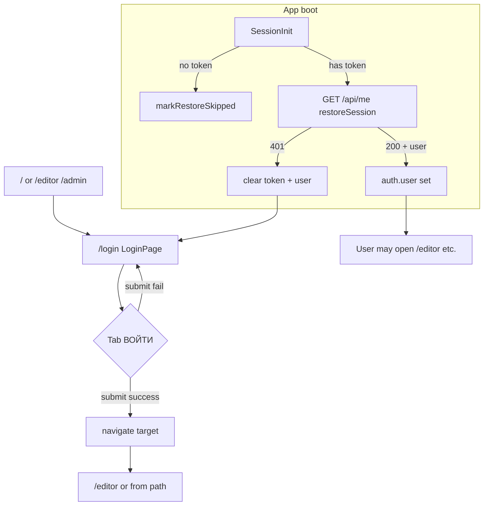

# User Flow: User Login

## 1. Purpose

Authenticate an **existing account** with **login** (not email) and **password** on the shared auth screen, receive a **JWT** and **user** from the backend, persist the session, and navigate into the app (typically **`/editor`**, or a path stored in **`location.state.from`**). Separately, **returning sessions** may be restored from **`localStorage`** without using the login form.

## 2. Scope

**Included**

- **Form-based login** on **`LoginPage`** (`/login`) via the default **`ВОЙТИ`** tab of **`Login`** (`src/legacy/routes/Login/index.tsx`).
- **`loginThunk`** in `src/features/auth/authSlice.ts`: `POST /api/auth/login`, token persistence, fulfilled/rejected handling.
- **Session restore** on app load when a token exists: **`SessionInit`** in `src/app/App.tsx` dispatches **`restoreSession`** → `GET /api/me` (registered user re-enters the app without submitting the login form, subject to token validity).
- **Guards and redirects** that send unauthenticated users to **`/login`** (`EditorPage`, `AdminPage`).
- **Guest notebook** path: user may open **`/editor`** without logging in; optional navigation to **`/login`** via **«ВОЙТИ →»**.

**Excluded**

- **Self-service registration** — documented in **`USER_FLOW_REGISTRATION.md`**.
- **Admin user creation** (`POST /api/admin/users`) — different endpoint and screen.
- **Password reset**, **refresh tokens**, **OAuth** — not implemented in this frontend (`README.md`).
- **Distinguishing “user does not exist” vs “wrong password”** in the UI — not implemented; both are **failed HTTP login** with whatever string the API returns (or status text).

## 3. Actors

| Actor | Role |
|--------|------|
| **Unauthenticated user (no valid session)** | Opens **`/login`** (directly or via redirect), stays on **`ВОЙТИ`** tab (default), submits **логин** + **пароль**. May be a **registered** user with correct/wrong credentials, or someone **without an account** attempting login — outcomes depend on the API. |
| **Guest user (`note` profile, no token)** | Uses **`/editor`** without auth; may open login via **«ВОЙТИ →»** to become authenticated. |
| **Returning registered user (stored JWT)** | App boot runs **`restoreSession`**; if **`/api/me`** succeeds and user is not **`disabled`**, **`auth.user`** is populated without the login form. |
| **Administrator** | Same login mechanism; **`/admin`** link appears in **`EditorPage`** only when **`user.role === "admin"`** after successful auth/restore. |
| **System / backend API** | Validates credentials for **`/api/auth/login`**; returns **`{ token, user }`** or error; **`/api/me`** validates JWT for restore. |

## 4. Entry Points

**Router:** **`BrowserRouter`** with **`basename={import.meta.env.BASE_URL}`** (from Vite `base`, usually `/`); paths below are **app-relative** (prepend basename when deployed under a subpath).

### 4.1. Onboarding (`/`) and reaching the login form

On **`OnboardingPage`**, the user picks a **work mode** in the **`Onboarding`** UI (`src/legacy/routes/Onboarding/index.tsx`), then clicks **`НАЧАТЬ →`**. `OnboardingPage.tsx` persists the chosen profile object to **`localStorage`** under **`ow_profile`**, then navigates based on **`p.mode`**:

| UI label | **`mode`** stored in profile | What happens after **`НАЧАТЬ →`** |
|----------|-------------------------------|--------------------------------------|
| **Сценарий** | **`film`** | `navigate("/login", { state: { from: { pathname: "/editor", search: "" } } })` — auth required before the editor. |
| **Пьеса** | **`play`** | Same: **`/login`** with **`state.from`** pointing at **`/editor`**. |
| **Видео** | **`short`** | Same. |
| **Медиа** | **`media`** | Same. |
| **Notebook** | **`note`** | `navigate("/editor")` — **no** mandatory **`/login`**. To sign in later: **«ВОЙТИ →»** in **`EditorScreen`** → **`EditorPage`** **`onLogin`** → **`/login`** with **`state.from`** pointing at **`/editor`** (same mechanism as the **`onLogin`** / guest row in §4.2). |

**Step-by-step for structured modes** (exactly one of **`film`**, **`play`**, **`short`**, **`media`** ends up in **`ow_profile`**):

1. User opens **`/`** and, in the **`Onboarding`** mode selector, picks **one** of the four structured options:

   - **Сценарий** → profile will have **`mode: "film"`**;
   - **Пьеса** → **`mode: "play"`**;
   - **Видео** → **`mode: "short"`**;
   - **Медиа** → **`mode: "media"`**.

2. User clicks **`НАЧАТЬ →`**: profile JSON with the chosen **`mode`** is written to **`localStorage`** under **`ow_profile`**, then navigation goes to **`/login`** with **`location.state.from`** targeting **`/editor`**.
3. User lands on **`LoginPage`** with the default **`ВОЙТИ`** tab; they enter **login** + **password** for an **existing** account (or may switch to **`РЕГИСТРАЦИЯ`** — see **`USER_FLOW_REGISTRATION.md`**).

**Step-by-step for guest notebook** (**`mode: "note"`** in **`ow_profile`**):

1. On **`/`**, user selects **Блокнот** in the onboarding wheel (see `src/legacy/routes/Onboarding/index.tsx` — `WHEEL_ITEMS[0]`), then **`НАЧАТЬ →`**: **`ow_profile`** stores **`mode: "note"`**, navigation goes to **`/editor`** with no JWT (**guest**, **`isGuest === true`** on **`EditorPage`**).
2. To sign in later: in **`EditorScreen`**, user clicks **«ВОЙТИ →»** → **`onLogin`** from **`EditorPage`** runs **`navigate("/login", { state: { from: { pathname: "/editor", search: "" } } })`** — then follow the form login steps in **§6** and **§7.3**.

### 4.2. Route summary for `/login`

| # | Entry | Source / context | Trigger |
|---|--------|-------------------|---------|
| 1 | **`/login`** | Direct navigation, bookmark, or external link. | User lands on **`LoginPage`**; **`Login`** default tab is **`ВОЙТИ`** (`useState("in")`). |
| 2 | **`/login`** + **`state.from`** | **`OnboardingPage` (`/`)** for structured profiles (`mode !== "note"`). | **`НАЧАТЬ →`** → `navigate("/login", { state: { from: { pathname: "/editor", search: "" } } })`. |
| 3 | **`/login`** + **`state.from`** | **`EditorPage` (`/editor`)** — **`needsAuth`** and **`!token`** and **`restoreStatus === "ready"`**. | **`<Navigate to="/login" replace state={{ from: …/editor }} />`**. |
| 4 | **`/login`** + **`state.from`** | **`EditorPage`** — **`onLogin`** from **`EditorScreen`** (e.g. guest **«ВОЙТИ →»**). | `navigate("/login", { state: { from: … } })`. |
| 5 | **`/login`** + **`state.from: /admin`** | **`AdminPage`** without session. | **`<Navigate to="/login" replace state={{ from: { pathname: "/admin", … } }} />`**. |

**No deep link to tabs:** Only the **`/login`** route exists; **`РЕГИСТРАЦИЯ`** is the second tab on the same **`Login`** component, not a separate URL.

**Session restore (no `/login` visit):** User opens any route with **`ow_token`** already in **`localStorage`** → **`SessionInit`** runs **`restoreSession`** → on success, **`auth.user`** is set (see §7).

## 5. Preconditions

- **`VITE_API_URL`** set for **`loginThunk`** and **`restoreSession`** (otherwise reject / skip paths as in `authSlice.ts`).
- For **form login**: user on **`LoginPage`**, **`ВОЙТИ`** tab, non-empty **логин** and **пароль** (client-side; see §9).
- For **restore**: non-null **`auth.token`** after **`buildInitialAuthState`** read from **`localStorage`** (`**ow_token**`).

## 6. Main Success Flow (registered user, form login)

1. User reaches **`LoginPage`** (`/login`) via §4; **`Login`** shows **`ВОЙТИ`** tab by default.
2. User enters **логин** and **пароль** (placeholders **`логин`**, **`пароль`**).
3. User clicks **`ВОЙТИ`** or presses **Enter** in login/password fields (`submit()`).
4. **`Login.submit`**: if `login` and `pass` are truthy, sets local **`loading`**, awaits **`submitLogin(login, pass)`**.
5. **`LoginPage`**: `dispatch(loginThunk({ login, password })).unwrap()`.
6. **`loginThunk`**: **`POST {VITE_API_URL}/api/auth/login`** with body **`{ login, password }`** (JSON). README states authentication uses **login, not email**.
7. On HTTP OK with **`token`** and **`user`**: Redux **`loginThunk.fulfilled`** sets **`auth.token`**, **`auth.user`**, writes **`localStorage`** key **`ow_token`**.
8. **`Login.submit`** calls **`onLogin()`** → **`clearFormError()`** + **`navigate(target, { replace: true })`** with **`target`** = `from.pathname + from.search` if present, else **`/editor`**.
9. User continues in app with an active session.

## 7. Alternative Flows

### 7.1 Returning registered user (session restore, no login form)

1. **`App`** mounts **`SessionInit`** (`src/app/App.tsx`).
2. If **`!token`**: **`markRestoreSkipped()`** → **`restoreStatus === "ready"`** without calling **`/api/me`**.
3. If **`token`** exists: **`restoreSession`** runs **`GET {VITE_API_URL}/api/me`** with **`Authorization: Bearer <token>`**.
4. **Fulfilled** with **`User`**: **`auth.user`** updated. If **`user.disabled === true`**: client **clears** token and user (`writeStoredToken(null)`), same as invalid session for protected areas.
5. User may navigate to **`/editor`** (or elsewhere) according to routing; **no automatic redirect to `/login`** from **`restoreSession` alone** — failed/401 paths clear token; UI depends on the page (e.g. **`EditorPage`** redirects to **`/login`** when **`needsAuth && !token`** after restore is ready).

### 7.2 Redirect target after successful form login

Same contract as post-registration navigation (`LoginPage.tsx`, see **`USER_FLOW_REGISTRATION.md`** §7.1): after **`loginThunk`** succeeds, **`onLogin()`** runs **`navigate(target, { replace: true })`** where **`target`** is **`from.pathname + from.search`** when **`location.state.from.pathname`** exists, otherwise **`/editor`**.

### 7.3 Guest opens editor, then chooses to log in

1. On **`/`**, user selects **Notebook** (**`mode: "note"`**; list label in code **«Блокн0т»**), **`НАЧАТЬ →`** → **`/editor`** as a **guest** (**`isGuest === true`** on **`EditorPage`**, no JWT).
2. In **`EditorScreen`**, user clicks **«ВОЙТИ →»** → **`onLogin`** from **`EditorPage`** runs: **`navigate("/login", { state: { from: { pathname: "/editor", search: "" } } })`**.
3. On **`/login`**, user enters **login** + **password** on the **`ВОЙТИ`** tab and submits successfully (§6).
4. After **`loginThunk.fulfilled`** and **`onLogin()`**, navigation returns to **`/editor`** with a token; **`isGuest`** becomes **`false`**.

## 8. Exception / Error Flows

### 8.1 Form login failures (covers “not registered” and wrong credentials)

The client **does not** branch on “account missing” vs “bad password”. Any failed login is:

| Scenario | Trigger | System response | User-visible message | Screen |
|----------|---------|-----------------|----------------------|--------|
| Empty login/password | `!login \|\| !pass` in **`Login.submit`** | No request | None (silent) | **`/login`** |
| Missing API URL | `apiBaseUrl()` empty | **`rejectWithValue("VITE_API_URL is not set")`** | That string in **`authError`** | **`/login`** |
| HTTP error (401, 404, etc.) | `!res.ok` in **`loginThunk`** | **`rejectWithValue(data?.error \|\| res.statusText)`** | API **`error`** or status text | **`/login`** |
| Malformed 200 response | Missing **`token`** or **`user`** | **`rejectWithValue("Некорректный ответ сервера")`** | That Russian string | **`/login`** |
| Thunk rejection fallback | No payload | **`lastError`** = `… \|\| "Ошибка входа"` | **`Ошибка входа`** or generic | **`/login`** |
| **`submitLogin` throws** | Caught in **`Login`** | **`loading`** cleared; Redux **`lastError`** set | **`authError`** | **`/login`** |

**Inferred (not coded in frontend):** A person **without a registered account** who only uses **«ВОЙТИ»** will typically receive a **non-OK** response from **`/api/auth/login`**; the UI path is the same as wrong password for a registered user. Exact HTTP codes and messages are **Needs confirmation** (backend).

### 8.2 Session restore failures

| Scenario | Behavior |
|----------|----------|
| **401** from **`/api/me`** | **`restoreSession.rejected`** with **`unauthorized`**: **`token`**, **`user`** cleared, **`localStorage`** token removed. User may then hit **`EditorPage`** guard → **`/login`**. |
| **`VITE_API_URL` missing** | **`rejectWithValue({ skipClear: true })`**: **`restoreStatus`** set ready; token **not** cleared by this path. |
| Other **`/api/me`** errors (non-401) | **`restoreStatus === "ready"`**; payload handling does **not** clear token in **`extraReducers`** (only **401** clears auth). **Needs confirmation** whether backend always uses 401 for invalid tokens. |

### 8.3 Logged-in / restored user blocked

- **`disabled` user** on successful **`/api/me`**: token and user cleared in **`restoreSession.fulfilled`** — user effectively unauthenticated.
- **`EditorPage`**: if **`needsAuth && token && restoreStatus === "ready" && !user`**, **`<Navigate to="/login" />`** — edge case if token exists but user never hydrated.

### 8.4 Other

- **«забыл пароль?»** — decorative **`span`**, no handler (`src/legacy/routes/Login/index.tsx`).
- **`adminApi`** **401**: dispatches **`clearAuth()`** — user logged out globally when an admin API call is unauthorized (not part of login form, but affects “logged in” state).

## 9. Validation Rules

**Client-side (confirmed)**

- **Login identifier:** first text field; sent as **`login`** in JSON (not **`email`**).
- **Password:** required non-empty (same falsy check as registration path).
- **Email field:** hidden on **`ВОЙТИ`** tab — not used for login submit.

**No client-side rules** for password strength, account existence, or rate limiting.

**Server-side**

- All authentication rules for **`/api/auth/login`** and **`/api/me`** — **Needs confirmation** (OpenAPI/backend).

## 10. Business Rules

**Supported by implementation**

- Successful login returns **JWT + user**; token stored under **`ow_token`**; **`user`** includes **`role`**, **`disabled`**, etc. (`src/api/types.ts`).
- **Disabled** accounts: cleared on **`restoreSession`** when **`user.disabled`** is true; **Needs confirmation** whether **`/api/auth/login`** can return **`disabled: true`** and how the client should behave (login **`fulfilled`** would still set token until a later **`/api/me`**).
- Post-login navigation: **`from`** state or **`/editor`**.
- **Logout** (`**EditorPage**` **`onLogout`**): **`clearAuth()`**, remove **`ow_profile`**, **`navigate("/", { replace: true })`** — no backend logout.

## 11. Navigation and Screen Transitions

- **`/`** → (structured profile) → **`/login`** → (success) → **`/editor`** (or **`from`**).
- **`/`** → (note) → **`/editor`** (guest) → optional **«ВОЙТИ →»** → **`/login`** → (success) → **`/editor`**.
- **`/editor`** (needs auth, no token, restore ready) → **`/login`**.
- **`/admin`** (unauthenticated) → **`/login`** with **`from`** admin.
- **`/login`** (success) → **`target`** with **`replace: true`**.
- **App load with valid token** → **`restoreSession`** → **`/editor`** or other routes without visiting **`/login`** first.

## 12. API / Data Interactions

### 12.1 Login

| Item | Detail |
|------|--------|
| **Endpoint** | `{VITE_API_URL}/api/auth/login` |
| **Method** | `POST` |
| **Body** | `{ "login": string, "password": string }` |
| **Success (client)** | JSON with **`token`** and **`user`**. |
| **Error (client)** | Non-OK: **`error`** from JSON if parseable, else **`res.statusText`**. |

### 12.2 Session restore

| Item | Detail |
|------|--------|
| **Endpoint** | `{VITE_API_URL}/api/me` |
| **Method** | `GET` |
| **Headers** | `Authorization: Bearer <token>` |
| **Success** | **`User`** JSON body. |
| **401** | Clears local auth in **`restoreSession.rejected`**. |

## 13. Postconditions

| Outcome | State |
|---------|--------|
| **Successful form login** | **`ow_token`** set; **`auth.token`** and **`auth.user`** set; **`lastError`** cleared on **`onLogin`** navigation. |
| **Failed form login** (wrong password, unknown user, server error) | **`lastError`** set; token unchanged unless a previous session existed (unchanged by failed **`loginThunk`**). User stays on **`/login`**. |
| **Successful restore** | **`auth.user`** matches API; token unchanged; **`restoreStatus === "ready"`**. |
| **401 restore** | Token and user cleared. |
| **Abandoned login** | No API call if fields empty; user may switch to registration tab or leave. |

## 14. UI States

| State | Behavior |
|-------|----------|
| **Idle** | Default **`ВОЙТИ`** tab; submit enabled when not loading. |
| **Typing** | Controlled inputs; no per-field errors from app logic. |
| **Validation (client)** | Silent return if login or password empty. |
| **Submitting** | Local **`loading`**: button disabled, label **«ВХОДИМ…»** (same as registration tab). |
| **Success** | **`onLogin`** → route change **`replace: true`**. |
| **Error** | Pink **`authError`** = **`auth.lastError`**. |

**Note:** Redux **`loginLoading`** is toggled by **`loginThunk`** but **`Login`** does not read it (local **`loading`** only).

**Editor waiting for session:** **`ВОССТАНОВЛЕНИЕ СЕССИИ…`** fullscreen when **`needsAuth && token && restoreStatus !== "ready"`** (`EditorPage.tsx`).

## 15. Open Questions / Needs Confirmation

- Exact **HTTP status codes** and **`error`** strings for invalid login vs unknown user (backend contract).
- Whether **`login`** response can include **`disabled: true`** and whether the client should clear the session immediately after login (currently **`disabled`** is handled on **`/api/me`** in **`restoreSession.fulfilled`**).
- Non-401 **`/api/me`** errors: token is not cleared in **`authSlice`** — intended or gap?
- **Remember-me** / session TTL — not in frontend.

## 16. Test Scenarios Derived from the Flow

- [ ] **`/login`** default tab shows **логин** + **пароль** only (no email); submit with valid registered credentials → **`/editor`**, **`ow_token`** set.
- [ ] **`/login`** with **`state.from`** `/admin` → success → navigates to **`/admin`** (then role gate if not admin).
- [ ] Empty login or password → no network call, no error banner.
- [ ] Mock **`POST /api/auth/login`** **401** with `{ "error": "…" }` → message shown, remain on **`/login`**, token not updated by this thunk.
- [ ] Mock login **200** without **`token`** → **«Некорректный ответ сервера»**.
- [ ] Store valid token, mock **`GET /api/me`** **200** → open **`/editor`** (needs auth): should show restore UI then editor (or **`/login`** if token cleared on failure).
- [ ] Mock **`/api/me`** returns **`disabled: true`** → token cleared; **`/editor`** with structured profile should redirect to **`/login`** when **`!token`** after ready.
- [ ] **Notebook** (**`mode: "note"`**, UI label in code **«Блокн0т»**) → **`/editor`** → **«ВОЙТИ →»** → **`/login`** with **`from: /editor`** → successful login per §6 → back to **`/editor`** with JWT and **`isGuest === false`**.

## Evidence from Code

| File / module | Relevance |
|---------------|-----------|
| `src/app/App.tsx` | Routes; **`SessionInit`** + **`restoreSession`** / **`markRestoreSkipped`**. |
| `src/pages/LoginPage.tsx` | **`loginThunk`**, **`lastError`**, **`navigate(target)`**, **`clearFormError`**. |
| `src/features/auth/authSlice.ts` | **`loginThunk`**, **`restoreSession`**, **`loginLoading`**, **`clearAuth`**, token key **`ow_token`**. |
| `src/legacy/routes/Login/index.tsx` | **`Login`**: default tab **`in`**, **`submitLogin`**, **`ВОЙТИ`** button, **`забыл пароль?`**. |
| `src/pages/EditorPage.tsx` | Auth guards, **`onLogin`**, **`onLogout`**, restore loading UI, **`isGuest`**. |
| `src/pages/OnboardingPage.tsx` | Navigation to **`/login`** vs **`/editor`**. |
| `src/pages/AdminPage.tsx` | Redirect to **`/login`** when unauthenticated. |
| `src/features/admin/adminApi.ts` | **401** → **`clearAuth()`**. |
| `src/api/env.ts` | **`apiBaseUrl()`**. |
| `README.md` | Login uses **login** not email; high-level auth behavior. |

---

*Behavior labeled **confirmed** is grounded in the cited files. Items marked **Needs confirmation** depend on backend semantics not fully specified in this repository.*
