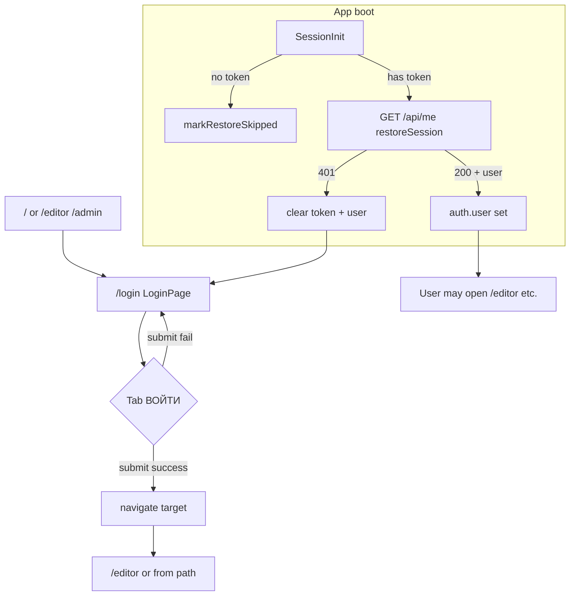

# Пользовательский сценарий: вход пользователя

**English:** [USER_FLOW_LOGIN.md](./USER_FLOW_LOGIN.md)

## 1. Цель

Аутентифицировать **существующую** учётную запись по **логину** (не email) и **пароль** на общем экране авторизации, получить от бэкенда **JWT** и **user**, сохранить сессию и перейти в приложение (обычно **`/editor`** или путь из **`location.state.from`**). Отдельно **возвращающаяся сессия** может восстанавливаться из **`localStorage`** без формы входа.

## 2. Область применения

**Включено**

- **Вход по форме** на **`LoginPage`** (`/login`) через вкладку по умолчанию **`ВОЙТИ`** в **`Login`** (`src/legacy/routes/Login/index.tsx`).
- **`loginThunk`** в `src/features/auth/authSlice.ts`: `POST /api/auth/login`, сохранение токена, fulfilled/rejected.
- **Восстановление сессии** при загрузке приложения, если есть токен: **`SessionInit`** в `src/app/App.tsx` диспатчит **`restoreSession`** → `GET /api/me` (зарегистрированный пользователь заходит без формы при действительном JWT).
- **Защита и редиректы**, отправляющие неаутентифицированного пользователя на **`/login`** (`EditorPage`, `AdminPage`).
- **Гостевой блокнот**: можно открыть **`/editor`** без входа; опционально **`/login`** через **«ВОЙТИ →»**.

**Исключено**

- **Самостоятельная регистрация** — в **`USER_FLOW_REGISTRATION.ru.md`**.
- **Создание пользователя админом** (`POST /api/admin/users`) — другой эндпоинт и экран.
- **Сброс пароля**, **refresh-токены**, **OAuth** — в этом фронтенде не реализовано (`README.md`).
- **Разделение в UI «пользователь не найден» и «неверный пароль»** — не реализовано; оба случая — **неуспешный HTTP-вход** со строкой из API (или `res.statusText`).

## 3. Акторы

| Актор | Роль |
|--------|------|
| **Неаутентифицированный пользователь (нет валидной сессии)** | Открывает **`/login`** (напрямую или по редиректу), по умолчанию вкладка **`ВОЙТИ`**, отправляет **логин** + **пароль**. Может быть **зарегистрированным** с верными/неверными данными или **без аккаунта** — исход определяется API. |
| **Гость (`note`, без токена)** | Пользуется **`/editor`** без auth; может открыть вход через **«ВОЙТИ →»**. |
| **Вернувшийся пользователь (JWT в хранилище)** | При старте приложения **`restoreSession`**; при успешном **`/api/me`** и не-**`disabled`** пользователе **`auth.user`** заполняется без формы. |
| **Администратор** | Тот же механизм входа; ссылка **`/admin`** в **`EditorPage`** только при **`user.role === "admin"`** после успешного входа/restore. |
| **Система / бэкенд API** | Проверка учётных для **`/api/auth/login`**; ответ **`{ token, user }`** или ошибка; **`/api/me`** валидирует JWT при restore. |

## 4. Точки входа

**Роутер:** **`BrowserRouter`** с **`basename={import.meta.env.BASE_URL}`** (из `base` в Vite, обычно `/`); пути ниже **относительно приложения** (при деплое под префиксом учитывайте basename).

### 4.1. Онбординг (`/`) и переход к форме входа

На **`OnboardingPage`** пользователь выбирает **режим работы** в UI **`Onboarding`** (`src/legacy/routes/Onboarding/index.tsx`), затем нажимает **`НАЧАТЬ →`**. В `OnboardingPage.tsx` выбранный объект профиля записывается в **`localStorage`** под ключом **`ow_profile`**, далее выполняется навигация в зависимости от **`p.mode`**:

| Подпись в UI | Значение **`mode`** в сохранённом профиле | Действие после **`НАЧАТЬ →`** |
|----------------|-------------------------------------------|--------------------------------|
| **Сценарий** | **`film`** | `navigate("/login", { state: { from: { pathname: "/editor", search: "" } } })` — перед редактором нужна аутентификация. |
| **Пьеса** | **`play`** | То же: **`/login`** + **`state.from`** на **`/editor`**. |
| **Видео** | **`short`** | То же. |
| **Медиа** | **`media`** | То же. |
| **Блокнот** | **`note`** | `navigate("/editor")` — **без** обязательного визита на **`/login`**. Чтобы войти позже: **«ВОЙТИ →»** в **`EditorScreen`** → **`EditorPage`** вызывает **`onLogin`** → **`/login`** с **`state.from`** на **`/editor`** (тот же механизм, что в §4.2 для гостя с **`onLogin`**). |

*Подпись режима Блокнот в коде задаётся в `src/legacy/routes/Onboarding/index.tsx` (`WHEEL_ITEMS[0]`); в профиле сохраняется **`mode: "note"`**.*

**Пошагово для структурированного режима** (в **`ow_profile`** окажется ровно один из: **`film`**, **`play`**, **`short`**, **`media`**):

1. Пользователь открывает **`/`** и в селекторе режимов **`Onboarding`** выбирает **один** из четырёх структурированных вариантов:

   - **Сценарий** → в профиле будет **`mode: "film"`**;
   - **Пьеса** → **`mode: "play"`**;
   - **Видео** → **`mode: "short"`**;
   - **Медиа** → **`mode: "media"`**.

2. Нажимает **`НАЧАТЬ →`**: в **`localStorage`** под **`ow_profile`** сохраняется JSON профиля с выбранным **`mode`**, выполняется переход на **`/login`** с **`location.state.from`**, указывающим на **`/editor`**.
3. На **`LoginPage`** по умолчанию активна вкладка **`ВОЙТИ`**; пользователь вводит **логин** и **пароль** существующей учётной записи (или может переключиться на **`РЕГИСТРАЦИЯ`** — это уже **`USER_FLOW_REGISTRATION.ru.md`**).

**Пошагово для гостевого блокнота** (в **`ow_profile`** будет **`mode: "note"`**):

1. Пользователь на **`/`** выбирает **Блокнот** в онбординг-колесе (см. `src/legacy/routes/Onboarding/index.tsx` — `WHEEL_ITEMS[0]`), затем нажимает **`НАЧАТЬ →`**: в **`ow_profile`** сохраняется **`mode: "note"`**, выполняется переход на **`/editor`** без JWT (**гость**, **`isGuest === true`** на **`EditorPage`**).
2. При желании войти: в **`EditorScreen`** нажимает **«ВОЙТИ →»** → срабатывает **`onLogin`** с **`EditorPage`**: **`navigate("/login", { state: { from: { pathname: "/editor", search: "" } } })`** — далее сценарий формы входа в **§6** и **§7.3**.

### 4.2. Сводная таблица маршрутов на `/login`

| № | Вход | Источник / контекст | Триггер |
|---|--------|---------------------|---------|
| 1 | **`/login`** | Прямой переход, закладка, внешняя ссылка. | Пользователь на **`LoginPage`**; вкладка по умолчанию **`ВОЙТИ`** (`useState("in")`). |
| 2 | **`/login`** + **`state.from`** | **`OnboardingPage` (`/`)** для структурированных профилей (`mode !== "note"`). | **`НАЧАТЬ →`** → `navigate("/login", { state: { from: … } })`. |
| 3 | **`/login`** + **`state.from`** | **`EditorPage` (`/editor`)** — **`needsAuth`**, **`!token`**, **`restoreStatus === "ready"`**. | **`<Navigate to="/login" … />`**. |
| 4 | **`/login`** + **`state.from`** | **`EditorPage`** — **`onLogin`** из **`EditorScreen`** (напр. гость **«ВОЙТИ →»**). | `navigate("/login", { state: { from: … } })`. |
| 5 | **`/login`** + **`state.from: /admin`** | **`AdminPage`** без сессии. | **`<Navigate to="/login" replace state={{ from: …/admin }} />`**. |

**Отдельного URL для вкладок нет:** существует только маршрут **`/login`**; вкладка **`РЕГИСТРАЦИЯ`** — вторая вкладка того же компонента **`Login`**, без deep link.

**Восстановление сессии (без визита на `/login`):** при наличии **`ow_token`** в **`localStorage`** **`SessionInit`** запускает **`restoreSession`** → при успехе задаётся **`auth.user`** (см. §7).

## 5. Предусловия

- Задан **`VITE_API_URL`** для **`loginThunk`** и **`restoreSession`** (иначе пути reject/skip из `authSlice.ts`).
- Для **формы входа**: **`LoginPage`**, вкладка **`ВОЙТИ`**, непустые **логин** и **пароль** (клиент; см. §9).
- Для **restore**: ненулевой **`auth.token`** после чтения **`buildInitialAuthState`** из **`localStorage`** (**`ow_token`**).

## 6. Основной успешный сценарий (зарегистрированный пользователь, форма)

1. Пользователь на **`LoginPage`** (`/login`) любым способом из §4; **`Login`** показывает **`ВОЙТИ`** по умолчанию.
2. Ввод **логин** и **пароль** (placeholders **`логин`**, **`пароль`**).
3. Клик **`ВОЙТИ`** или **Enter** в полях логина/пароля (`submit()`).
4. **`Login.submit`**: при truthy `login` и `pass` — локальный **`loading`**, ожидание **`submitLogin(login, pass)`**.
5. **`LoginPage`**: `dispatch(loginThunk({ login, password })).unwrap()`.
6. **`loginThunk`**: **`POST {VITE_API_URL}/api/auth/login`**, тело **`{ login, password }`** (JSON). В `README.md` указано: аутентификация по **логину**, не по email.
7. При HTTP OK с **`token`** и **`user`**: **`loginThunk.fulfilled`** — **`auth.token`**, **`auth.user`**, запись **`ow_token`** в **`localStorage`**.
8. **`Login.submit`** вызывает **`onLogin()`** → **`clearFormError()`** + **`navigate(target, { replace: true })`**, **`target`** = `from.pathname + from.search` при наличии, иначе **`/editor`**.
9. Пользователь продолжает работу с активной сессией.

## 7. Альтернативные сценарии

### 7.1 Вернувшийся пользователь (restore сессии, без формы)

1. **`App`** монтирует **`SessionInit`** (`src/app/App.tsx`).
2. При **`!token`**: **`markRestoreSkipped()`** → **`restoreStatus === "ready"`** без вызова **`/api/me`**.
3. При наличии **`token`**: **`restoreSession`** — **`GET {VITE_API_URL}/api/me`** с **`Authorization: Bearer <token>`**.
4. **Fulfilled** с **`User`**: обновляется **`auth.user`**. Если **`user.disabled === true`**: клиент **очищает** токен и пользователя (`writeStoredToken(null)`), как при недействительной сессии для защищённых зон.
5. Дальнейшая навигация по роутингу; **автоматического редиректа на `/login` только от `restoreSession`** нет — при 401/skip токен очищается; UI зависит от страницы (например **`EditorPage`** ведёт на **`/login`** при **`needsAuth && !token`** после готовности restore).

### 7.2 Цель редиректа после успешного входа по форме

Полностью аналогично сценарию после регистрации (`LoginPage.tsx`, см. **`USER_FLOW_REGISTRATION.ru.md`** §7.1): после успешного **`loginThunk`** вызывается **`onLogin()`** → **`navigate(target, { replace: true })`**, где **`target`** = **`from.pathname + from.search`**, если в **`location.state`** есть **`from.pathname`**, иначе **`/editor`**.

### 7.3 Гость открыл редактор, затем решил войти

1. Пользователь на **`/`** выбирает **Блокнот** (**`mode: "note"`**; подпись в списке в коде — **«Блокн0т»**), нажимает **`НАЧАТЬ →`** и попадает на **`/editor`** как **гость** (**`isGuest === true`** на **`EditorPage`**, без JWT).
2. В **`EditorScreen`** нажимает **«ВОЙТИ →»** → срабатывает **`onLogin`**, переданный из **`EditorPage`**: **`navigate("/login", { state: { from: { pathname: "/editor", search: "" } } })`**.
3. На **`/login`** пользователь вводит **логин** и **пароль** на вкладке **`ВОЙТИ`** и успешно отправляет форму (§6).
4. После **`loginThunk.fulfilled`** и **`onLogin()`** выполняется переход обратно на **`/editor`** с JWT; **`isGuest`** становится **`false`**, сессия активна.

## 8. Исключения / ошибки

### 8.1 Сбои входа по форме (в т.ч. «не зарегистрирован» и неверный пароль)

Клиент **не различает** «аккаунта нет» и «неверный пароль». Любой неуспешный вход:

| Ситуация | Триггер | Реакция | Сообщение | Экран |
|----------|---------|---------|-----------|--------|
| Пустой логин/пароль | `!login \|\| !pass` в **`Login.submit`** | Запроса нет | Нет (тихо) | **`/login`** |
| Нет URL API | пустой `apiBaseUrl()` | **`rejectWithValue("VITE_API_URL is not set")`** | В **`authError`** | **`/login`** |
| HTTP-ошибка (401, 404, …) | `!res.ok` в **`loginThunk`** | **`rejectWithValue(data?.error \|\| res.statusText)`** | **`error`** из API или текст статуса | **`/login`** |
| 200 без `token`/`user` | битое тело | **`rejectWithValue("Некорректный ответ сервера")`** | Эта строка | **`/login`** |
| Reject без payload | редко | **`lastError`** с fallback **`"Ошибка входа"`** | **`Ошибка входа`** или общее | **`/login`** |
| **`submitLogin` бросает** | catch в **`Login`** | сброс **`loading`**; в Redux **`lastError`** | **`authError`** | **`/login`** |

**Вывод по фронту (не закодировано явно):** пользователь **без регистрации**, нажав только **«ВОЙТИ»**, обычно получит **non-OK** от **`/api/auth/login`**; путь UI совпадает с неверным паролем у зарегистрированного. Точные коды и тексты — **требуют подтверждения** у бэкенда.

### 8.2 Сбои восстановления сессии

| Ситуация | Поведение |
|----------|-----------|
| **401** от **`/api/me`** | **`restoreSession.rejected`**, **`unauthorized`**: **`token`**, **`user`** очищены, токен удалён из **`localStorage`**. Далее возможен гард **`EditorPage`** → **`/login`**. |
| Нет **`VITE_API_URL`** | **`rejectWithValue({ skipClear: true })`**: **`restoreStatus`** ready; токен **не** очищается этим путём. |
| Другие ошибки **`/api/me`** (не 401) | **`restoreStatus === "ready"`**; в **`extraReducers`** токен **не** сбрасывается (сброс только при **401**). **Требует подтверждения**, всегда ли бэкенд для невалидного токена отвечает 401. |

### 8.3 Заблокированный после входа / restore

- **`disabled`**: при успешном **`/api/me`** в **`restoreSession.fulfilled`** токен и user очищаются — фактически без сессии.
- **`EditorPage`**: при **`needsAuth && token && restoreStatus === "ready" && !user`** — **`<Navigate to="/login" />`** (крайний случай: токен есть, user не подтянулся).

### 8.4 Прочее

- **«забыл пароль?»** — декоративный **`span`**, обработчика нет (`src/legacy/routes/Login/index.tsx`).
- **401** в **`adminApi`**: **`clearAuth()`** — глобальный выход при неавторизованном вызове админ API (не часть формы входа, но влияет на «вошёл ли пользователь»).

## 9. Правила валидации

**На клиенте (подтверждено)**

- **Идентификатор входа:** первое текстовое поле; в JSON уходит как **`login`**, не **`email`**.
- **Пароль:** обязательная непустая строка (та же falsy-проверка, что у ветки регистрации).
- **Поле email** на вкладке **`ВОЙТИ`** скрыто — в submit входа не участвует.

**На клиенте нет** проверки сложности пароля, существования аккаунта, rate limiting.

**На сервере**

- Все правила для **`/api/auth/login`** и **`/api/me`** — **требуют подтверждения** (OpenAPI/бэкенд).

## 10. Бизнес-правила

**Поддерживается реализацией**

- Успешный вход возвращает **JWT + user**; токен в **`ow_token`**; в **`user`** есть **`role`**, **`disabled`** и др. (`src/api/types.ts`).
- **Отключённые** аккаунты: очистка при **`restoreSession`**, если **`user.disabled`**. **Требует подтверждения**, может ли **`/api/auth/login`** вернуть **`disabled: true`** и как должен вести себя клиент (при **`fulfilled`** входа токен всё равно записывается до возможного последующего **`/api/me`**).
- Навигация после входа: **`from`** или **`/editor`**.
- **Выход** (**`onLogout`** на **`EditorPage`**): **`clearAuth()`**, удаление **`ow_profile`**, **`navigate("/", { replace: true })`** — без эндпоинта logout на бэкенде.

## 11. Навигация и переходы экранов

- **`/`** → (структурированный профиль) → **`/login`** → (успех) → **`/editor`** (или **`from`**).
- **`/`** → (note) → **`/editor`** (гость) → опционально **«ВОЙТИ →»** → **`/login`** → (успех) → **`/editor`**.
- **`/editor`** (нужна auth, нет токена, restore ready) → **`/login`**.
- **`/admin`** (без сессии) → **`/login`** с **`from`** админки.
- **`/login`** (успех) → **`target`**, **`replace: true`**.
- **Загрузка приложения с валидным токеном** → **`restoreSession`** → **`/editor`** или другие маршруты без предварительного **`/login`**.

## 12. API / обмен данными

### 12.1 Вход

| Пункт | Детали |
|--------|--------|
| **Эндпоинт** | `{VITE_API_URL}/api/auth/login` |
| **Метод** | `POST` |
| **Тело** | `{ "login": string, "password": string }` |
| **Успех (клиент)** | JSON с **`token`** и **`user`**. |
| **Ошибка (клиент)** | Non-OK: **`error`** из JSON при разборе, иначе **`res.statusText`**. |

### 12.2 Восстановление сессии

| Пункт | Детали |
|--------|--------|
| **Эндпоинт** | `{VITE_API_URL}/api/me` |
| **Метод** | `GET` |
| **Заголовки** | `Authorization: Bearer <token>` |
| **Успех** | JSON тела **`User`**. |
| **401** | Локальная авторизация очищается в **`restoreSession.rejected`**. |

## 13. Постусловия

| Исход | Состояние |
|--------|-----------|
| **Успешный вход по форме** | **`ow_token`** задан; **`auth.token`** и **`auth.user`**; **`lastError`** сброшен при **`onLogin`**. |
| **Неуспешный вход** (неверный пароль, нет пользователя, ошибка сервера) | **`lastError`** задан; токен не меняется этим **`loginThunk`** (предыдущая сессия, если была, не трогается этим reject). Пользователь на **`/login`**. |
| **Успешный restore** | **`auth.user`** соответствует API; токен без изменений; **`restoreStatus === "ready"`**. |
| **401 при restore** | Токен и user очищены. |
| **Прерванный вход** | Пустые поля — запроса нет; можно переключиться на регистрацию или уйти. |

## 14. Состояния UI

| Состояние | Поведение |
|-----------|-----------|
| **Idle** | Вкладка **`ВОЙТИ`** по умолчанию; submit доступен вне loading. |
| **Ввод** | Контролируемые поля; ошибок по полям из логики приложения нет. |
| **Валидация (клиент)** | Тихий return при пустом логине или пароле. |
| **Отправка** | Локальный **`loading`**: кнопка disabled, подпись **«ВХОДИМ…»** (как на вкладке регистрации). |
| **Успех** | **`onLogin`** → смена маршрута, **`replace: true`**. |
| **Ошибка** | Розовый **`authError`** = **`auth.lastError`**. |

**Замечание:** Redux **`loginLoading`** переключается **`loginThunk`**, но **`Login`** его не читает (только локальный **`loading`**).

**Ожидание в редакторе:** полноэкранное **`ВОССТАНОВЛЕНИЕ СЕССИИ…`** при **`needsAuth && token && restoreStatus !== "ready"`** (`EditorPage.tsx`).

## 15. Открытые вопросы / требует подтверждения

- Точные **HTTP-коды** и строки **`error`** для неверного входа и несуществующего пользователя (контракт бэкенда).
- Может ли ответ **`login`** содержать **`disabled: true`** и должен ли клиент сразу сбросить сессию (сейчас **`disabled`** обрабатывается при **`/api/me`** в **`restoreSession.fulfilled`**).
- Ошибки **`/api/me`** не-401: токен в **`authSlice`** не очищается — задумано или пробел?
- **Remember-me** / TTL сессии — не на фронтенде.

## 16. Контрольные сценарии для тестирования

- [ ] **`/login`**: только **логин** + **пароль** (без email); валидные данные → **`/editor`**, **`ow_token`** задан.
- [ ] **`/login`** с **`state.from`** `/admin` → успех → переход на **`/admin`** (затем гейт роли, если не admin).
- [ ] Пустой логин или пароль → запроса нет, баннера ошибки нет.
- [ ] Mock **`POST /api/auth/login`** **401** с `{ "error": "…" }` → сообщение, остаёмся на **`/login`**, токен этим thunk не обновляется.
- [ ] Mock **200** без **`token`** → **«Некорректный ответ сервера»**.
- [ ] Валидный токен в хранилище, mock **`GET /api/me` 200** → открыть **`/editor`** (needs auth): сначала UI восстановления, затем редактор (или **`/login`** при очищенном токене).
- [ ] Mock **`/api/me`** с **`disabled: true`** → токен очищен; **`/editor`** со структурированным профилем → **`/login`** при **`!token`** после ready.
- [ ] **Блокнот** (**`mode: "note"`**, подпись в UI в коде **«Блокн0т»**) → **`/editor`** → **«ВОЙТИ →»** → **`/login`** с **`from: /editor`** → успешный вход по §6 → снова **`/editor`** с JWT и **`isGuest === false`**.

## Основания в коде

| Файл / модуль | Зачем |
|---------------|--------|
| `src/app/App.tsx` | Маршруты; **`SessionInit`**, **`restoreSession`**, **`markRestoreSkipped`**. |
| `src/pages/LoginPage.tsx` | **`loginThunk`**, **`lastError`**, **`navigate(target)`**, **`clearFormError`**. |
| `src/features/auth/authSlice.ts` | **`loginThunk`**, **`restoreSession`**, **`loginLoading`**, **`clearAuth`**, **`ow_token`**. |
| `src/legacy/routes/Login/index.tsx` | **`Login`**: вкладка **`in`**, **`submitLogin`**, **`ВОЙТИ`**, **`забыл пароль?`**. |
| `src/pages/EditorPage.tsx` | Гарды, **`onLogin`**, **`onLogout`**, UI восстановления, **`isGuest`**. |
| `src/pages/OnboardingPage.tsx` | Переходы на **`/login`** / **`/editor`**. |
| `src/pages/AdminPage.tsx` | Редирект на **`/login`** без сессии. |
| `src/features/admin/adminApi.ts` | **401** → **`clearAuth()`**. |
| `src/api/env.ts` | **`apiBaseUrl()`**. |
| `README.md` | Вход по логину, не по email; обзор auth. |

---

*Поведение, помеченное как **подтверждённое**, опирается на перечисленные файлы. Пункты **«требует подтверждения»** зависят от семантики бэкенда вне полного описания в этом репозитории.*
