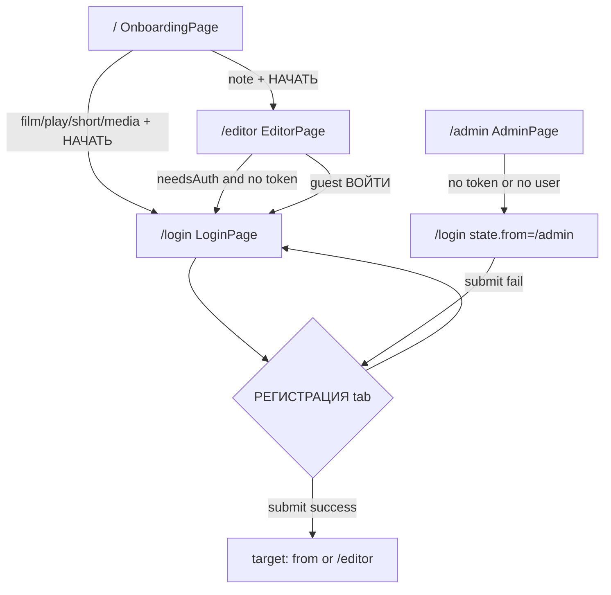

# User Flow: User Registration

## 1. Purpose

Create a new application account by submitting **login**, **email**, and **password** on the combined login/registration screen, receiving a **JWT** and **user** payload from the backend, persisting the session locally, and continuing into the app (typically the editor, or another route captured as a post-auth redirect target).

## 2. Scope

**Included**

- Self-service registration available on **`LoginPage`** (`/login`) via the **`РЕГИСТРАЦИЯ`** tab of the shared **`Login`** UI (`src/legacy/legacyUiBundle.tsx`).
- Client-side behavior: form fields, tab switching, local loading/disabled submit, silent guards for empty fields, error display from Redux `auth.lastError`, success navigation via `LoginPage` `onLogin` callback.
- Redux **`registerThunk`** (`src/features/auth/authSlice.ts`): `POST /api/auth/register`, token storage, fulfilled/rejected state updates.

**Excluded**

- **Admin-provisioned users** (`POST /api/admin/users` on `AdminPage` via `adminApi` RTK Query) — separate actor, endpoint, and UI; not end-user self-registration.
- **Guest “Блокн0т” (`note`)** profile: opens **`/editor`** without authentication; no registration on that path unless the user later chooses **«ВОЙТИ →»** (see entry points).
- **Password reset**, **email verification**, **OAuth/social signup**, **profile editing** — not implemented in this frontend (confirmed in `README.md`).

## 3. Actors

| Actor | Role |
|--------|------|
| **Unauthenticated user** | Selects a non-guest profile or opens `/login`, switches to registration, submits the form. |
| **Registered / authenticated user** | Not the primary actor for registration; may indirectly influence redirect targets if `location.state.from` was set before login. |
| **Administrator** | Uses `/admin` user creation; outside this document’s main flow. |
| **System / backend API** | Validates and persists registration; returns `{ token, user }` or an error body; authoritative rules for uniqueness, password strength, etc. |

## 4. Entry Points

Router: `BrowserRouter` with `basename={import.meta.env.BASE_URL}` (from Vite `base`, often `/`); paths below are **app-relative** (prepend basename when deployed under a subpath).

| # | Entry | Source screen / context | Trigger |
|---|--------|-------------------------|---------|
| 1 | **`/login`** (direct URL or refresh) | None — user lands on `LoginPage`. | User navigates manually or follows a bookmark/link. |
| 2 | **`/login` with `location.state.from`** | **`OnboardingPage` (`/`)** after profile pick where `p.mode !== "note"` | **`НАЧАТЬ →`** on onboarding calls `onSelect(item)` → `navigate("/login", { state: { from: { pathname: "/editor", search: "" } } })`. |
| 3 | **`/login` with `state.from`** | **`EditorPage` (`/editor`)** when `needsAuth` (any profile mode except **`note`**) and no token after restore is ready | React Router **`<Navigate to="/login" replace state={{ from: { pathname: "/editor", search: "" } }} />`**. |
| 4 | **`/login` with `state.from`** | **`EditorPage`**: in-app control | **`EditorPage`** passes **`onLogin`** to **`EditorScreen`**: `navigate("/login", { state: { from: { pathname: "/editor", search: "" } } })`. Used from guest notebook **«ВОЙТИ →»** (`isGuest` + `mode === "note"`). |
| 5 | **`/login` with `state.from: /admin`** | **`AdminPage` (`/admin`)** without valid session | **`<Navigate to="/login" replace state={{ from: { pathname: "/admin", search: "" } }} />`** when `!token` or `restoreStatus === "ready"` and `!user`. |

**Reaching the registration tab (not a separate route):** From `LoginPage`, the user must select the **`РЕГИСТРАЦИЯ`** tab on **`Login`**. There is **no** dedicated `/register` URL or deep link to the tab in code.

## 5. Preconditions

- **Browser environment** with `localStorage` available for token persistence (writes are best-effort; failures are swallowed in `writeStoredToken`).
- **`VITE_API_URL`** must be non-empty at runtime; otherwise `registerThunk` rejects with **`"VITE_API_URL is not set"`** (from `apiBaseUrl()` in `src/api/env.ts`).
- User is on **`LoginPage`** with the **`РЕГИСТРАЦИЯ`** tab active to see the email field and call `submitRegister`.

## 6. Main Success Flow

1. **User** arrives at **`LoginPage`** (`Route path="/login"` in `src/app/App.tsx`) via any entry in §4 and selects the **`РЕГИСТРАЦИЯ`** tab (`Login` local state `tab === "reg"`).
2. **User** enters **логин** (login input, placeholder `логин`), **email** (placeholder `email`, `type="email"`), **пароль** (password input, placeholder `пароль`).
3. **User** activates **`СОЗДАТЬ АККАУНТ`** (submit button) or presses **Enter** in login/password fields (`onKeyDown` calls `submit()`).
4. **`Login.submit`** (`legacyUiBundle.tsx`): if `login` and `pass` are truthy and (`tab !== "reg"` or `email` is truthy), sets local **`loading`** true, disables the button, awaits **`submitRegister(login, email, pass)`** from props.
5. **`LoginPage`** `submitRegister` dispatches **`registerThunk({ login, email, password })`** and **`.unwrap()`** on success.
6. **`registerThunk`**: `POST {VITE_API_URL}/api/auth/register` with JSON body **`{ login, email, password }`**, `Content-Type: application/json`. On HTTP OK, requires JSON with **`token`** and **`user`**; otherwise rejects.
7. **Redux** (`registerThunk.fulfilled`): sets **`auth.token`**, **`auth.user`**, **`registerLoading: false`**, persists token to **`localStorage`** key **`ow_token`**.
8. **`Login.submit`** completes without throw; calls **`onLogin()`** → **`LoginPage`** runs **`clearFormError()`** and **`navigate(target, { replace: true })`** where **`target`** = `location.state.from.pathname + from.search` if `from.pathname` exists, else **`"/editor"`**.
9. **User** lands on **`/editor`** (default) or **`/admin`** (if `state.from` pointed there), with an active JWT and user in the store.

## 7. Alternative Flows

- **Redirect target after registration** — Same as after login: if **`location.state.from`** was passed (e.g. from **`EditorPage`** or **`AdminPage`** guard), navigation uses that path instead of **`/editor`** (`LoginPage.tsx`).
- **Registration after choosing a structured profile** — User picks **Сценарий / Пьеса / Видео / Медиа** on onboarding → **`/login`** with **`from: /editor`** → user switches to **`РЕГИСТРАЦИЯ`** → success → **`/editor`** with auth (profile already in **`localStorage`** as **`ow_profile`** from onboarding).
- **No separate modal or wizard** — Registration is only the second tab on the same card UI.

## 8. Exception / Error Flows

| Scenario | Trigger | System response | User-visible message | Stays on screen / redirect |
|----------|---------|-----------------|----------------------|----------------------------|
| Empty login or password | `!login \|\| !pass` in **`Login.submit`** | Returns immediately; no API call | None (silent) | Same **`/login`**, same tab |
| Registration tab, empty email | `tab === "reg" && !email` | Returns immediately; no API call | None (silent) | Same |
| Missing API base URL | `apiBaseUrl()` returns `""` | `registerThunk` → `rejectWithValue("VITE_API_URL is not set")` | **`auth.lastError`** string | Same; **`Login`** shows pink **`authError`** block |
| HTTP error from API | `!res.ok` | `rejectWithValue(data?.error \|\| res.statusText)` | Server **`error`** string if JSON parse succeeded and field present; else HTTP status text | Same |
| HTTP 200 but missing `token` or `user` | Malformed success body | `rejectWithValue("Некорректный ответ сервера")` | That Russian string | Same |
| Non-JSON error body | `readJsonSafe` parse fail | Treats body as `{ error: text }` | Raw text in **`error`** if used in reject path | Same |
| Thunk rejection without custom payload | Rare edge cases | `lastError` = `String(action.payload \|\| action.error.message \|\| "Ошибка регистрации")` | **`Ошибка регистрации`** or generic message | Same |
| **`submitRegister` throws** (e.g. `.unwrap()` on rejection) | Caught in **`Login.submit`** `catch` | Local **`loading`** cleared; Redux already set **`lastError`** | **`authError`** from parent | Same |
| Network / fetch failure | Fetch throws before handled response | Rejected thunk; message via **`action.error.message`** when no payload | Typically browser/network message | Same |

**Note:** **`registerLoading`** in Redux is updated by **`registerThunk`**, but **`Login`** does not read it; submit UX uses **local `loading`** only.

**«забыл пароль?»** (login tab only) is a non-functional **`span`** with `cursor: pointer` — no navigation or handler in **`Login`**.

## 9. Validation Rules

**Client-side (confirmed)**

- **Login:** required non-empty string (falsy check); no min/max length in UI.
- **Password:** required non-empty string (falsy check); no client-side strength or confirmation field.
- **Email (registration tab):** required non-empty string for submit; input **`type="email"`** (browser hint only; submit is a **button** and the inputs are **not** wrapped in a `<form>`, so **HTML5 constraint validation is not explicitly invoked** in code — **Needs confirmation** whether all browsers block invalid email on Enter/button without `reportValidity()`).

**Server-side**

- All business rules (unique login/email, password policy, etc.) are enforced by the backend; errors are expected in the JSON **`error`** field or HTTP status text as consumed by **`registerThunk`**. Exact messages and status codes are **Needs confirmation** from backend/OpenAPI in this repo.

## 10. Business Rules

**Supported by this frontend implementation**

- Successful registration returns **JWT + user**; client stores **JWT** in **`localStorage`** under the key **`ow_token`** and keeps **`user`** in the **`auth`** slice — same pattern as **`loginThunk`**.
- After success, **user is treated as logged in** (no separate “activate account” step in UI).
- Post-registration navigation respects **`location.state.from`** when provided; otherwise **`/editor`**.
- **`User`** shape expected from API aligns with **`src/api/types.ts`** (`id`, `login`, `email`, `role`, `disabled`, `created_at`).

**Not represented in registration-specific code**

- Uniqueness of login/email, account activation, email verification — **backend / OpenAPI**; **Needs confirmation** for exact behavior.

## 11. Navigation and Screen Transitions

- **`/`** (`OnboardingPage`) → (non-note **`НАЧАТЬ →`**) → **`/login`** (optional `state.from` → editor).
- **`/editor`** → (unauthenticated structured profile, or missing user after restore) → **`/login`** with `from` editor; guest note **`ВОЙТИ →`** → **`/login`** with `from` editor.
- **`/admin`** (no token / no user) → **`/login`** with `from` admin.
- **`/login`** (`РЕГИСТРАЦИЯ` tab) → (success) → **`/editor`** or **`state.from`** path (`replace: true`).
- **`/login`** → (failure) → remains **`/login`**.

## 12. API / Data Interactions

| Item | Detail |
|------|--------|
| **Endpoint** | `{VITE_API_URL}/api/auth/register` (no trailing slash on base; see `apiBaseUrl()`) |
| **Method** | `POST` |
| **Headers** | `Content-Type: application/json` |
| **Request body** | `{ "login": string, "email": string, "password": string }` |
| **Success (client expectation)** | HTTP **2xx**, JSON with **`token`** (string) and **`user`** (object matching **`User`** type). |
| **Success side effects** | `auth.token`, `auth.user` set; `localStorage.setItem("ow_token", token)`. |
| **Error (client handling)** | Non-OK: uses parsed JSON **`error`** if available, else `res.statusText`. Invalid OK body: fixed Russian message for missing `token`/`user`. |

**Token/session after registration:** Same as login — **Bearer** token for **`GET /api/me`** on subsequent **`restoreSession`** when app loads with stored token (`README.md` / `authSlice.ts`).

## 13. Postconditions

| Outcome | System state |
|---------|----------------|
| **Successful registration** | JWT in **`localStorage` (`ow_token`)**; **`auth.token`** and **`auth.user`** set; **`auth.lastError`** cleared on navigation via **`clearFormError`**; user on **`/editor`** or **`from`** route. |
| **Failed registration** | No token write on rejection path beyond any prior session; **`auth.lastError`** set; user remains on **`/login`**; local form fields retain typed values (component not remounted). |
| **Abandoned registration** | No API call if required fields empty; user may switch tabs or leave route; no partial server state observable from frontend. |

## 14. UI States

| State | Behavior |
|-------|----------|
| **Idle** | Default; submit enabled when not loading. |
| **Typing** | Controlled inputs; no inline field-level errors from app logic. |
| **Validation error** | Only silent early returns for empty required fields; optional browser email hints — see §9. |
| **Submitting / loading** | Local **`loading`**: submit disabled, button shows whale icon + **`ВХОДИМ...`** (same copy for login and registration). |
| **Success** | Brief loading end → **`onLogin`** → route change. |
| **Server / thunk error** | Pink centered text below button: **`authError`** prop (`auth.lastError`). |

## 15. Open Questions / Needs Confirmation

- Exact **HTTP status codes** and **`error`** message strings returned by the backend for duplicate login/email, weak password, etc. (not defined in frontend source beyond generic handling).
- Whether **email format** is validated beyond empty-string check (no `reportValidity()` in **`Login.submit`**).
- Whether whitespace-only **login / email / password** are acceptable to the API (client only checks JavaScript falsy; spaces are truthy).
- Full **OpenAPI** contract for **`/api/auth/register`** if it differs from the assumed `{ token, user }` / `{ error }` shapes.

## 16. Test Scenarios Derived from the Flow

- [ ] From **`/`**, pick **Сценарий** (or any non-note mode) → **`/login`** → **`РЕГИСТРАЦИЯ`** → valid credentials → lands **`/editor`**, **`ow_token`** set, editor loads with profile.
- [ ] Direct **`/login`** (no `state`) → register → lands **`/editor`** (default target).
- [ ] Hit **`/admin`** logged out → redirected to **`/login`** with `from` → register (if API allows non-admin user) → expect navigation to **`/admin`** then insufficient-rights UI if role is not admin — **product-dependent**; at minimum assert navigation to **`from`** path.
- [ ] Submit with empty login/password/email where applicable → **no** request, **no** error banner.
- [ ] Mock API **409** / **400** with `{ "error": "…" }` → message shown, stay on **`/login`**, token unchanged.
- [ ] Mock API **200** without `token` → **`Некорректный ответ сервера`** shown.
- [ ] Unset **`VITE_API_URL`** (or empty) → registration shows **`VITE_API_URL is not set`** (or verify build-time expectations in CI).

## Evidence from Code

| File / module | Relevance |
|---------------|-----------|
| `src/app/App.tsx` | Routes: `/`, `/login`, `/editor`, `/admin`. |
| `src/pages/LoginPage.tsx` | Wires **`Login`** to **`registerThunk`**, **`lastError`**, post-auth **`navigate(target)`**. |
| `src/pages/OnboardingPage.tsx` | Navigates to **`/login`** for non-note profiles with `state.from`. |
| `src/pages/EditorPage.tsx` | Auth guard **`Navigate` to `/login`**, **`onLogin`** → **`/login`**. |
| `src/pages/AdminPage.tsx` | Unauthenticated **`Navigate` to `/login`** with admin **`from`**. |
| `src/features/auth/authSlice.ts` | **`registerThunk`**, **`registerLoading`**, **`lastError`**, token persistence **`ow_token`**. |
| `src/legacy/legacyUiBundle.tsx` | **`Login`** component: tabs **ВОЙТИ** / **РЕГИСТРАЦИЯ**, fields, submit logic, **`onLogin`** after success. |
| `src/api/env.ts` | **`apiBaseUrl()`** / **`VITE_API_URL`**. |
| `src/api/types.ts` | **`User`** type for **`user`** in responses. |
| `README.md` | High-level auth endpoints and excluded flows. |
| `vite.config.ts` | **`base`** / router basename via **`VITE_BASE_PATH`**. |

---

*Behavior described above is **confirmed** where it cites concrete components, routes, and handlers. Items explicitly labeled **Needs confirmation** are not inferable from the frontend repository alone.*
