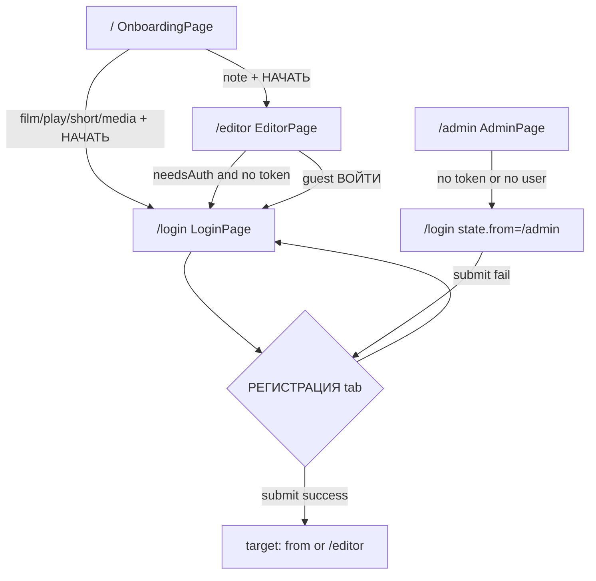

# Пользовательский сценарий: регистрация пользователя

**English:** [USER_FLOW_REGISTRATION.md](./USER_FLOW_REGISTRATION.md)

## 1. Цель

Создать учётную запись приложения, отправив **логин**, **email** и **пароль** на объединённом экране входа/регистрации, получить от бэкенда **JWT** и объект **user**, сохранить сессию локально и перейти в приложение (обычно в редактор или другой маршрут из post-auth redirect).

## 2. Область применения

**Включено**

- Самостоятельная регистрация на **`LoginPage`** (`/login`) через вкладку **`РЕГИСТРАЦИЯ`** общего UI **`Login`** (`src/legacy/legacyUiBundle.tsx`).
- Поведение на клиенте: поля формы, переключение вкладок, локальный `loading`/блокировка submit, «тихие» проверки пустых полей, отображение ошибок из Redux `auth.lastError`, успешная навигация через колбэк `onLogin` в `LoginPage`.
- Redux **`registerThunk`** (`src/features/auth/authSlice.ts`): `POST /api/auth/register`, сохранение токена, состояния fulfilled/rejected.

**Исключено**

- **Пользователи, созданные админом** (`POST /api/admin/users` на `AdminPage` через RTK Query `adminApi`) — другой актор, эндпоинт и UI; не самостоятельная регистрация конечного пользователя.
- **Гостевой профиль «Блокн0т» (`note`)**: открывает **`/editor`** без аутентификации; регистрации на этом пути нет, пока пользователь не выберет **«ВОЙТИ →»** (см. точки входа).
- **Сброс пароля**, **подтверждение email**, **OAuth / соцрегистрация**, **редактирование профиля** — в этом фронтенде не реализовано (см. `README.md`).

## 3. Акторы

| Актор | Роль |
|--------|------|
| **Неаутентифицированный пользователь** | Выбирает не-гостевой профиль или открывает `/login`, переключается на регистрацию, отправляет форму. |
| **Зарегистрированный / аутентифицированный пользователь** | Не основной актор регистрации; может косвенно влиять на цель редиректа, если до входа был задан `location.state.from`. |
| **Администратор** | Создание пользователей через `/admin`; вне основного потока этого документа. |
| **Система / бэкенд API** | Валидация и сохранение регистрации; ответ `{ token, user }` или тело ошибки; правила уникальности, сложности пароля и т.д. |

## 4. Точки входа

Роутер: `BrowserRouter` с `basename={import.meta.env.BASE_URL}` (из `base` в Vite, чаще всего `/`); пути ниже **относительно приложения** (при деплое под префиксом добавьте basename).

| № | Вход | Экран / контекст | Триггер |
|---|--------|------------------|---------|
| 1 | **`/login`** (прямой URL или обновление) | Нет — пользователь попадает на `LoginPage`. | Ручной переход, закладка, ссылка. |
| 2 | **`/login` с `location.state.from`** | **`OnboardingPage` (`/`)** после выбора профиля, где `p.mode !== "note"` | **`НАЧАТЬ →`** вызывает `onSelect(item)` → `navigate("/login", { state: { from: { pathname: "/editor", search: "" } } })`. |
| 3 | **`/login` с `state.from`** | **`EditorPage` (`/editor`)** при `needsAuth` (любой режим профиля кроме **`note`**) и отсутствии токена после готовности restore | **`<Navigate to="/login" replace state={{ from: { pathname: "/editor", search: "" } }} />`**. |
| 4 | **`/login` с `state.from`** | **`EditorPage`**: внутри приложения | **`EditorPage`** передаёт **`onLogin`** в **`EditorScreen`**: `navigate("/login", { state: { from: { pathname: "/editor", search: "" } } })`. Используется из гостевого блокнота **«ВОЙТИ →»** (`isGuest` + `mode === "note"`). |
| 5 | **`/login` с `state.from: /admin`** | **`AdminPage` (`/admin`)** без валидной сессии | **`<Navigate to="/login" replace state={{ from: { pathname: "/admin", search: "" } }} />`** при `!token` или `restoreStatus === "ready"` и `!user`. |

**Попадание на вкладку регистрации (отдельного маршрута нет):** с `LoginPage` пользователь должен выбрать вкладку **`РЕГИСТРАЦИЯ`** в **`Login`**. В коде **нет** URL `/register` и deep link на вкладку.

## 5. Предусловия

- **Браузер** с доступным `localStorage` для токена (запись best-effort; сбои глотаются в `writeStoredToken`).
- **`VITE_API_URL`** непустая в рантайме; иначе `registerThunk` отклоняется с **`"VITE_API_URL is not set"`** (`apiBaseUrl()` в `src/api/env.ts`).
- Пользователь на **`LoginPage`** с активной вкладкой **`РЕГИСТРАЦИЯ`**, чтобы было поле email и вызывался `submitRegister`.

## 6. Основной успешный сценарий

1. **Пользователь** попадает на **`LoginPage`** (`Route path="/login"` в `src/app/App.tsx`) любым способом из §4 и выбирает вкладку **`РЕГИСТРАЦИЯ`** (локальное состояние `Login`: `tab === "reg"`).
2. Вводит **логин** (placeholder `логин`), **email** (placeholder `email`, `type="email"`), **пароль** (placeholder `пароль`).
3. Нажимает **`СОЗДАТЬ АККАУНТ`** или **Enter** в полях логина/пароля (`onKeyDown` вызывает `submit()`).
4. **`Login.submit`** (`legacyUiBundle.tsx`): при truthy `login` и `pass` и (`tab !== "reg"` или truthy `email`) включается локальный **`loading`**, блокируется кнопка, ожидается **`submitRegister(login, email, pass)`** из props.
5. **`LoginPage`**: `submitRegister` диспатчит **`registerThunk({ login, email, password })`** и **`.unwrap()`** при успехе.
6. **`registerThunk`**: `POST {VITE_API_URL}/api/auth/register` с JSON **`{ login, email, password }`**, заголовок `Content-Type: application/json`. При HTTP OK требуется JSON с **`token`** и **`user`**; иначе reject.
7. **Redux** (`registerThunk.fulfilled`): **`auth.token`**, **`auth.user`**, **`registerLoading: false`**, токен в **`localStorage`** под ключом **`ow_token`**.
8. **`Login.submit`** завершается без исключения; вызывается **`onLogin()`** → **`LoginPage`**: **`clearFormError()`** и **`navigate(target, { replace: true })`**, где **`target`** = `location.state.from.pathname + from.search`, если есть `from.pathname`, иначе **`"/editor"`**.
9. **Пользователь** оказывается на **`/editor`** (по умолчанию) или **`/admin`** (если `state.from` указывал туда), с активным JWT и пользователем в store.

## 7. Альтернативные сценарии

- **Цель редиректа после регистрации** — как после входа: при переданном **`location.state.from`** (например с **`EditorPage`** или гарда **`AdminPage`**) навигация идёт по этому пути, а не на **`/editor`** (`LoginPage.tsx`).
- **Регистрация после выбора структурированного профиля** — пользователь выбирает **Сценарий / Пьеса / Видео / Медиа** на onboarding → **`/login`** с **`from: /editor`** → вкладка **`РЕГИСТРАЦИЯ`** → успех → **`/editor`** с авторизацией (профиль уже в **`localStorage`** как **`ow_profile`** с onboarding).
- **Отдельного мастера или модалки нет** — только вторая вкладка той же карточки.

## 8. Исключения / ошибки

| Ситуация | Триггер | Реакция системы | Сообщение пользователю | Экран / редирект |
|----------|---------|-----------------|------------------------|------------------|
| Пустой логин или пароль | `!login \|\| !pass` в **`Login.submit`** | Немедленный return, запроса нет | Нет (тихо) | Тот же **`/login`**, та же вкладка |
| Вкладка регистрации, пустой email | `tab === "reg" && !email` | Return, запроса нет | Нет (тихо) | То же |
| Нет базового URL API | `apiBaseUrl()` возвращает `""` | `registerThunk` → `rejectWithValue("VITE_API_URL is not set")` | Строка в **`auth.lastError`** | То же; розовый блок **`authError`** в **`Login`** |
| HTTP-ошибка API | `!res.ok` | `rejectWithValue(data?.error \|\| res.statusText)` | Поле **`error`** из JSON или текст статуса | То же |
| HTTP 200 без `token` или `user` | Повреждённое тело успеха | `rejectWithValue("Некорректный ответ сервера")` | Эта русская строка | То же |
| Не-JSON тело ошибки | сбой разбора в `readJsonSafe` | трактуется как `{ error: text }` | Сырой текст в **`error`**, если попал в reject | То же |
| Reject thunk без payload | редкие случаи | `lastError` = `String(action.payload \|\| … \|\| "Ошибка регистрации")` | **`Ошибка регистрации`** или общее | То же |
| **`submitRegister` бросает** (например `.unwrap()` при reject) | catch в **`Login.submit`** | сброс локального **`loading`**; в Redux уже **`lastError`** | **`authError`** от родителя | То же |
| Сеть / сбой fetch | исключение до обработанного ответа | rejected thunk; при отсутствии payload — **`action.error.message`** | Обычно сообщение браузера о сети | То же |

**Замечание:** в Redux обновляется **`registerLoading`** от **`registerThunk`**, но компонент **`Login`** его не читает; UX отправки — только локальный **`loading`**.

**«забыл пароль?»** (только вкладка входа) — нефункциональный **`span`** с `cursor: pointer`, без навигации и обработчика в **`Login`**.

## 9. Правила валидации

**На клиенте (подтверждено кодом)**

- **Логин:** обязательная непустая строка (проверка на falsy); min/max длины в UI нет.
- **Пароль:** обязательная непустая строка; нет проверки сложности и поля подтверждения.
- **Email (вкладка регистрации):** для submit нужна непустая строка; у input **`type="email"`** (подсказка браузеру); submit — **кнопка**, поля **не** обёрнуты в `<form>`, явный **`reportValidity()`** в коде **не вызывается** — **требует подтверждения**, блокируют ли все браузеры невалидный email по Enter/клику без `reportValidity()`.

**На сервере**

- Бизнес-правила (уникальность логина/email, политика пароля и т.д.) на бэкенде; ошибки ожидаются в JSON в поле **`error`** или в тексте HTTP, как обрабатывает **`registerThunk`**. Точные коды и строки — **требуют подтверждения** по бэкенду/OpenAPI вне этого репозитория.

## 10. Бизнес-правила

**Поддерживается реализацией фронтенда**

- Успешная регистрация возвращает **JWT + user**; JWT в **`localStorage`** под ключом **`ow_token`**, **`user`** в слайсе **`auth`** — тот же паттерн, что у **`loginThunk`**.
- После успеха пользователь **считается вошедшим** (отдельного шага «активация аккаунта» в UI нет).
- Навигация после регистрации учитывает **`location.state.from`**, иначе **`/editor`**.
- Форма **`User`** от API согласована с **`src/api/types.ts`** (`id`, `login`, `email`, `role`, `disabled`, `created_at`).

**В коде регистрации не отражено**

- Уникальность логина/email, активация, верификация email — **бэкенд / OpenAPI**; **требует подтверждения**.

## 11. Навигация и переходы экранов

- **`/`** (`OnboardingPage`) → (не-note, **`НАЧАТЬ →`**) → **`/login`** (опционально `state.from` → редактор).
- **`/editor`** → (нужна авторизация, нет токена) → **`/login`** с `from` редактора; гостевой note, **`ВОЙТИ →`** → **`/login`** с `from` редактора.
- **`/admin`** (нет токена / нет user) → **`/login`** с `from` админки.
- **`/login`** (вкладка **`РЕГИСТРАЦИЯ`**) → (успех) → **`/editor`** или путь из **`state.from`** (`replace: true`).
- **`/login`** → (ошибка) → остаётся **`/login`**.

## 12. API / обмен данными

| Пункт | Детали |
|--------|--------|
| **Эндпоинт** | `{VITE_API_URL}/api/auth/register` (у базы без завершающего слэша; см. `apiBaseUrl()`) |
| **Метод** | `POST` |
| **Заголовки** | `Content-Type: application/json` |
| **Тело запроса** | `{ "login": string, "email": string, "password": string }` |
| **Успех (ожидание клиента)** | HTTP **2xx**, JSON с **`token`** (string) и **`user`** (объект типа **`User`**). |
| **Побочные эффекты успеха** | `auth.token`, `auth.user`; `localStorage.setItem("ow_token", token)`. |
| **Ошибка (обработка клиента)** | Non-OK: поле **`error`** из JSON при наличии, иначе `res.statusText`. Некорректное тело 200: фиксированное русское сообщение при отсутствии `token`/`user`. |

**Токен после регистрации:** как при входе — **Bearer** для **`GET /api/me`** при последующем **`restoreSession`** при загрузке приложения с сохранённым токеном (`README.md` / `authSlice.ts`).

## 13. Постусловия

| Исход | Состояние системы |
|--------|-------------------|
| **Успешная регистрация** | JWT в **`localStorage` (`ow_token`)**; **`auth.token`** и **`auth.user`**; **`auth.lastError`** сбрасывается при навигации через **`clearFormError`**; пользователь на **`/editor`** или маршруте **`from`**. |
| **Неуспешная регистрация** | При reject токен не записывается (с предыдущей сессией — без изменений от этого thunk); **`auth.lastError`** задан; пользователь на **`/login`**; значения полей сохраняются (компонент не размонтирован). |
| **Прерванная регистрация** | Пустые обязательные поля — запроса нет; можно сменить вкладку или уйти с маршрута; частичное состояние на сервере с фронта не наблюдается. |

## 14. Состояния UI

| Состояние | Поведение |
|-----------|-----------|
| **Idle** | По умолчанию; submit доступен, пока нет loading. |
| **Ввод** | Контролируемые inputs; отдельных ошибок по полям из логики приложения нет. |
| **Ошибка валидации** | Только тихий return при пустых обязательных полях; опционально подсказки браузера для email — см. §9. |
| **Отправка / loading** | Локальный **`loading`**: кнопка disabled, на кнопке кит + **`ВХОДИМ...`** (тот же текст, что и при входе). |
| **Успех** | Конец loading → **`onLogin`** → смена маршрута. |
| **Ошибка сервера / thunk** | Розовый центрированный текст под кнопкой: prop **`authError`** (`auth.lastError`). |

## 15. Открытые вопросы / требует подтверждения

- Точные **HTTP-коды** и строки **`error`** от бэкенда при дубликате логина/email, слабом пароле и т.д. (во фронтенде только общая обработка).
- Проверяется ли **формат email** сверх проверки на непустую строку (нет `reportValidity()` в **`Login.submit`**).
- Принимает ли API **логин / email / пароль** из одних пробелов (в JS пробелы — truthy для `!email` и т.д.).
- Полный контракт **OpenAPI** для **`/api/auth/register`**, если отличается от предполагаемых форм `{ token, user }` / `{ error }`.

## 16. Контрольные сценарии для тестирования

- [ ] С **`/`** выбрать **Сценарий** (или любой не-note) → **`/login`** → **`РЕГИСТРАЦИЯ`** → валидные данные → **`/editor`**, **`ow_token`** задан, редактор с профилем.
- [ ] Прямой **`/login`** (без `state`) → регистрация → **`/editor`** (цель по умолчанию).
- [ ] **`/admin`** без входа → редирект на **`/login`** с `from` → регистрация (если API создаёт не-админа) → переход на **`/admin`**, затем экран недостаточных прав, если роль не admin — **зависит от продукта**; минимум — проверить переход по пути **`from`**.
- [ ] Отправка с пустыми логином/паролем/email где применимо → **нет** запроса, **нет** баннера ошибки.
- [ ] Mock API **409** / **400** с `{ "error": "…" }` → сообщение на экране, остаёмся на **`/login`**, токен не меняется.
- [ ] Mock **200** без `token` → **`Некорректный ответ сервера`**.
- [ ] Пустой **`VITE_API_URL`** → сообщение **`VITE_API_URL is not set`** (или проверка ожиданий сборки в CI).

## Основания в коде

| Файл / модуль | Зачем |
|---------------|--------|
| `src/app/App.tsx` | Маршруты: `/`, `/login`, `/editor`, `/admin`. |
| `src/pages/LoginPage.tsx` | Связка **`Login`** с **`registerThunk`**, **`lastError`**, post-auth **`navigate(target)`**. |
| `src/pages/OnboardingPage.tsx` | Переход на **`/login`** для не-note с `state.from`. |
| `src/pages/EditorPage.tsx` | Гард **`Navigate` на `/login`**, **`onLogin`**. |
| `src/pages/AdminPage.tsx` | **`Navigate` на `/login`** без сессии с admin **`from`**. |
| `src/features/auth/authSlice.ts` | **`registerThunk`**, **`registerLoading`**, **`lastError`**, **`ow_token`**. |
| `src/legacy/legacyUiBundle.tsx` | **`Login`**: вкладки, поля, submit, **`onLogin`**. |
| `src/api/env.ts` | **`apiBaseUrl()`**, **`VITE_API_URL`**. |
| `src/api/types.ts` | Тип **`User`**. |
| `README.md` | Обзор эндпоинтов и исключённых потоков. |
| `vite.config.ts` | **`base`** / basename через **`VITE_BASE_PATH`**. |

---

*Поведение помечено как **подтверждённое**, где явно ссылаются на компоненты, маршруты и обработчики. Пункты **«требует подтверждения»** из репозитория фронтенда однозначно не выводятся.*
